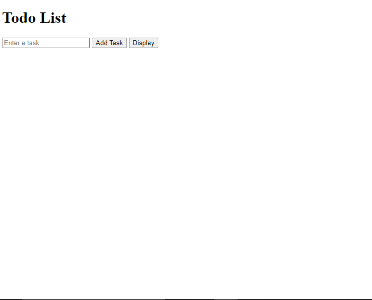
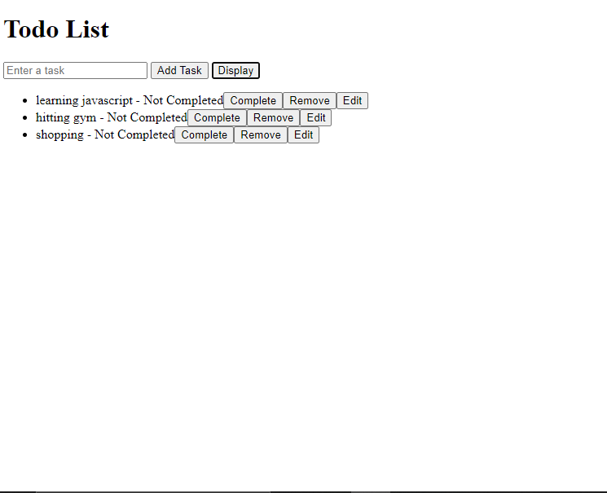

# Todo List Application

This is a simple Todo List application built using TypeScript and HTML. It allows users to add, display, edit, remove, and mark tasks as complete or incomplete.

## Features

- **Add Task**: Enter a task in the input field and click the "Add Task" button to add it to the list.
- **Display**: Click the "Show All Tasks" button to display all tasks with options to edit, remove, and toggle completion status.
- **Edit Task**: Update an existing task by clicking the "Edit" button next to the task.
- **Remove Task**: Delete a task from the list by clicking the "Remove" button.
- **Complete/Undo Task**: Mark a task as complete or incomplete by clicking the "Complete" or "Undo" button.

## Getting Started

### Prerequisites

- Node.js and npm installed on your system.

### Setup

1.  **Clone the Repository**

    -git clone https://github.com/kalebwondimu33/Todolist_typescript.git
    -cd TODOLIST_TYPESCRIPT
    -tsc
    -open index.html

                       ### How to Use #####

#### Add a Task

-Enter a task in the input field and click the "Add Task" button.

### Display

Click the "Display" button to view all tasks with options to edit, remove, or mark them as complete.

##### Edit a Task

Click the "Edit" button next to the task you want to modify. Enter the new task text and save.

### Remove a Task

Click the "Remove" button next to the task you want to delete.

### Toggle Task Completion

Click the "Complete" button to mark a task as complete or the "Undo" button to revert it.

                   # screenshoot

# home screen

# display

